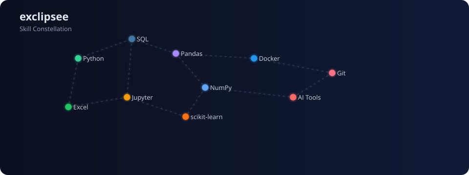

  
  
  <!-- Professional Value Proposition Banner -->
  <table>
    <tr>
      <td align="center" width="33%">
        
         <b>Production Experience</b>
      </td>
      <td align="center" width="34%">
        
         <b>Quality-Focused Companies</b>
      </td>
      <td align="center" width="33%">
        
         <b>Immediate Contributor</b>
      </td>
    </tr>
  </table>

  

## 🚀 Professional Profile

- 💼 **4+ Years Production Experience** — Building real solutions with Python, Excel, and data systems since 2021.
- 🎯 **Junior Developer Position** — CS degree in progress (remote) + planning advanced IT specialization.
- 🌍 **Strategic Location Advantage** — Remote-first with Bayern on-site capability (licensed driver, flexible travel).
- 🛡️ **Expanding Technical Reach** — Adding cybersecurity and system hardening to core data science stack.
- 🧠 **Competitive Edge** — Multilingual professional: English (C1), Polish (C2), German (B1), Ukrainian/Russian (Native).
- ⚡ **Immediate Impact** — No ramp-up time needed, ready to contribute from day one.

## 🎯 Strategic Skill Expansion

Continuously advancing my technical capabilities through industry-recognized certifications and hands-on implementation.

**Core Technology Mastery:**
- **Advanced Python & Systems Programming** — CS50x (C fundamentals), CS50P (Python architecture)
- **Production Automation** — Advanced Python scripting and workflow optimization
- **Enterprise Data Analytics** — IBM Data Science Professional + Google Advanced Analytics tracks

**Professional Development Pipeline:**
- **Data Science Specialization** — Statistical modeling, ML implementation, data visualization at scale  
- **Excel Mastery** — Advanced functions, Power Query, automated reporting systems, executive dashboards
- **Security-First Development** — Network fundamentals, system hardening, threat modeling basics

> **Note:** All completed certifications are systematically documented in a dedicated repository for verification.

## 🛠️ Tech stack

- Languages: Python, C, Markdown
- Data & Analysis: Excel, Power Query, Pandas, NumPy, Matplotlib, Seaborn, scikit‑learn, Jupyter
- Tools: Git, GitHub, VS Code, Windows, WSL/Linux basics

<!-- Language/tool badges -->

  

## 🌟 Featured projects

- **Multi‑tool AI Assistant** — Production-ready AI integration system with advanced tooling capabilities and workflow automation.
- **Modern C Portfolio** — Low-level systems programming solutions demonstrating memory management and performance optimization.
- **Python Mastery Portfolio** — Data processing utilities, automation scripts, and analytical tools for real-world applications.

## 🎯 Current Professional Focus

- **Advanced System Architecture** — Deepening C programming, algorithms, and data structure implementation for performance-critical applications
- **Production Data Pipelines** — Scaling Python + Excel solutions for enterprise-level data analysis and reporting
- **Full-Stack Portfolio Development** — Building comprehensive, deployment-ready projects that demonstrate end-to-end technical capabilities  
- **Security-Conscious Development** — Integrating cybersecurity principles into development workflows (network security, system hardening, threat assessment)

## 📈 GitHub stats

  
  

  

  

## 🏆 GitHub Trophies

  

## 🤝 Professional Collaboration

  
  

- **Seeking:** Junior Developer positions with growth-oriented companies (remote-first or Bayern on-site)
- **Response Time:** Professional inquiries receive priority attention within 24 hours
- **Collaboration Style:** Direct communication, solution-focused approach, delivery-oriented mindset

---

  
  

  

